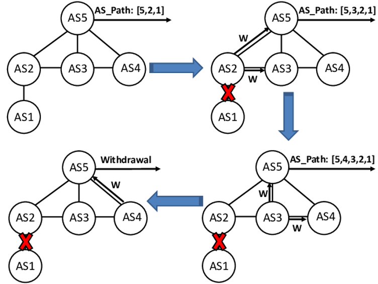

## BGP Monitor Tool

The internet plays a crucial role in many essential activities, and its functionality relies heavily on the Border Gateway Protocol (BGP). As a result, any performance issues, or malfunctions with BGP can have global implications, impacting economies and productivity on a massive scale.

The BGP monitor script scans for any updates in the BGP information and triggers an alert notification while also sending an email to the designated recipient.

